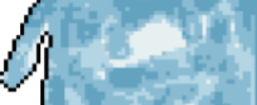

<h1 align='center'>Hi👻 I'm kocumazɐ!!</h1>

## Links (:≡

## Likes <°))彡

  
  
  
  

## Environment ≡[°-°]≡

  
  
  
  
  

## Learning (:｡≡

  
  
  
  
  
  
  
  
  

  ## Stats >ﾟ ))彡

  
  

  
  

